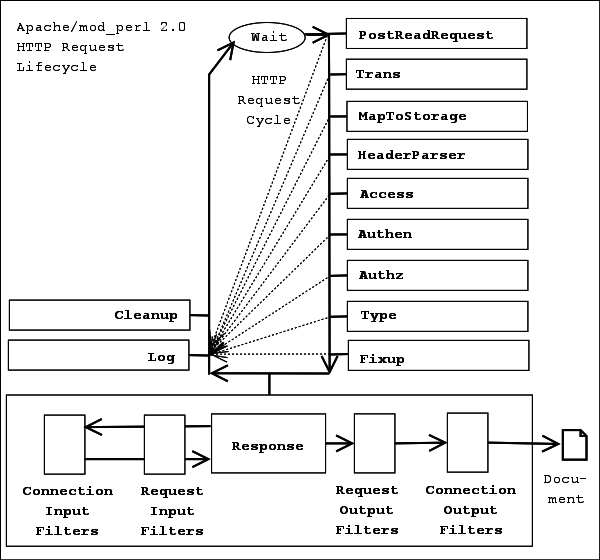
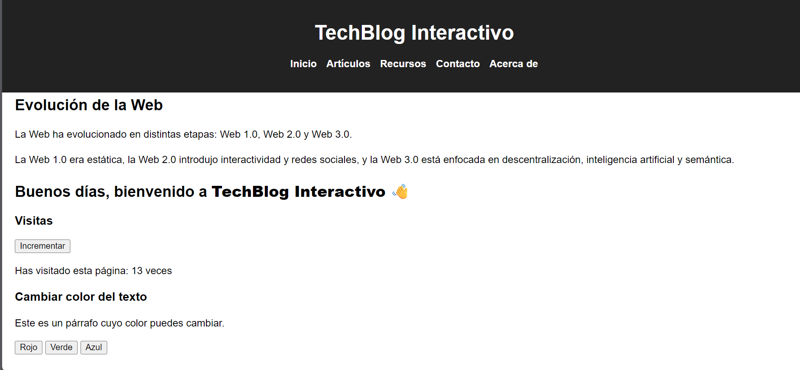
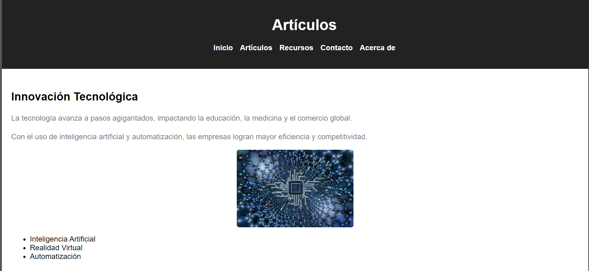
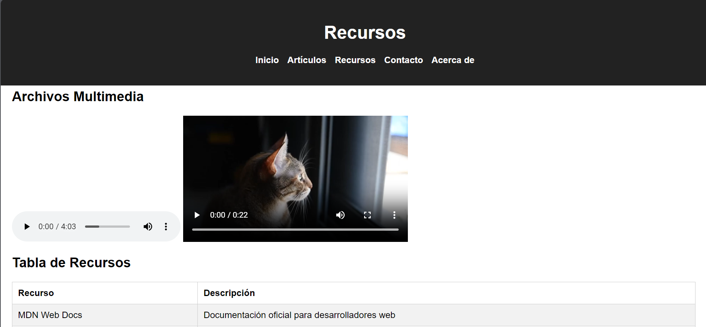
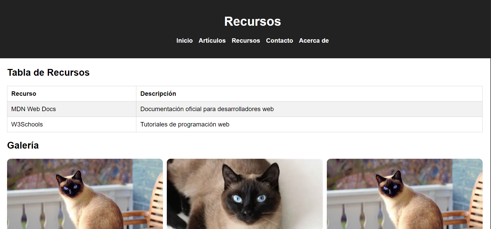
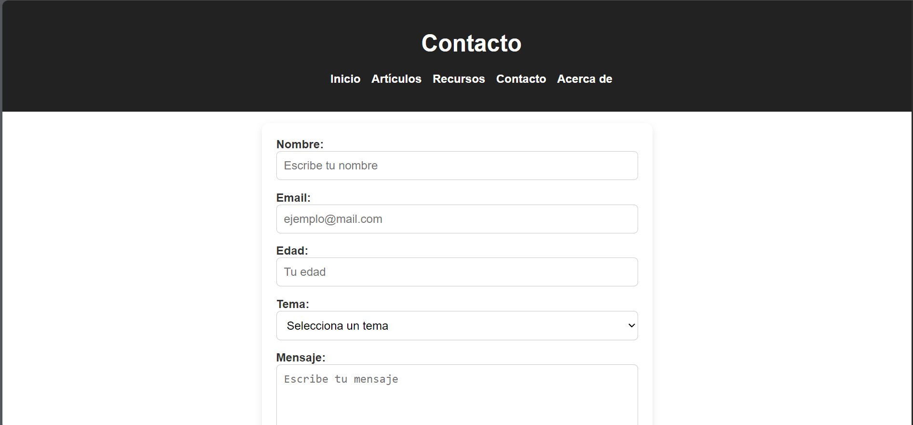

<section>
  <h2>Evolución de la Web</h2>
  
La Web ha evolucionado en distintas etapas: Web 1.0, Web 2.0 y Web 3.0.

  
La Web 1.0 era estática, la Web 2.0 introdujo interactividad y redes sociales, y la Web 3.0 
    está enfocada en descentralización, inteligencia artificial y semántica.

</section>

## Capturas de pantalla

